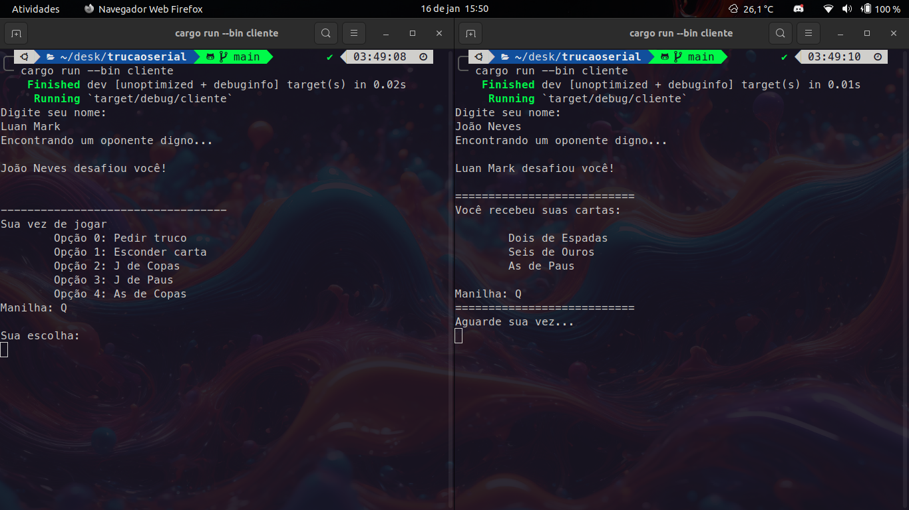

# Desenvolvedores
* Luan Mark
  * github: [@Lord-Mark](https://github.com/Lord-Mark)
* João Neves Soares
  * github: [@JoaoNevesSoares](https://github.com/JoaoNevesSoares)

# Configurando seu ambiente
Para rodar este projeto você precisa ter o ambiente rust configurado,
se você não tem o rust ou o cargo instalado, então siga as instruções em https://www.rust-lang.org/tools/install

## Instalando dependências
Dê o comando `cargo build` para instalar as dependências do projeto

# Rodando a aplicação
Para rodar a aplicação localmente você deve abrir três terminais diferentes, no primeiro terminal dê o comando `cargo run --bin server`, que irá iniciar o servidor truco.
Nos dois seguintes terminais dê o comando `cargo run --bin cliente` e comece a jogar!

Para executar a aplicação em sua rede, é necessário ajustar o endereço IP registrado na variável `server_ip` no arquivo `/src/bin/server.rs`. Além disso, é preciso editar o IP registrado na variável `meu_ip` em `/src/bin/cliente.rs`. Após essas modificações, a aplicação estará pronta para ser utilizada. Agora você pode desfrutar de um truquinho desenvolvido Rust na sua rede local ou, se preferir, executar a aplicação utilizando o IP de uma rede virtual gerado por serviços como Hamachi ou Haguichi.

## Screenshots

